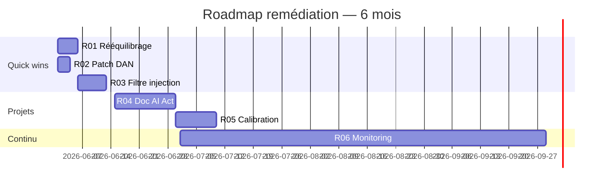

# 💡 Étape 6 — Synthèse et plan de remédiation

> **Durée estimée** : 0,5 jour (4 heures)
> **Livrable** : Plan de remédiation chiffré et priorisé
> **Prérequis** : Étapes 1-5 terminées

---

## 🎯 Pourquoi cette étape est cruciale

C'est **la valeur business** de votre audit. Vos clients ne paient pas pour
savoir qu'ils ont des biais — ils paient pour savoir **comment les corriger**.

C'est aussi votre **différenciation majeure** sur le marché : Giskard et
Credo AI font de l'audit, peu font de la remédiation actionnable.

### 📖 Ce qui distingue un bon plan de remédiation

❌ **Mauvais** : *"Améliorez la diversité de vos données d'entraînement."*
→ Inactionnable, abstrait.

✅ **Bon** : *"Ajoutez 240 exemples de CV de femmes seniors (50+) au dataset de fine-tuning. Coût estimé : 2 jours-homme. Impact attendu : amélioration du selection_rate de cette population de 12 % à 28 %."*
→ Précis, chiffré, évaluable.

Trois principes :

1. **Chaque recommandation est actionnable** : un développeur ou un PM
   sait quoi faire dès lecture.
2. **Chaque recommandation est mesurable** : on peut prouver après coup
   qu'elle a fonctionné.
3. **Chaque recommandation est priorisée** : on sait par où commencer.

---

## 🗺️ Vue d'ensemble

```
6.1  Construction du score global multi-axes
6.2  Priorisation des problèmes (impact × effort)
6.3  Plan de remédiation par famille
6.4  Roadmap chiffrée
6.5  Playbook de négociation fournisseur (LLM SaaS)
6.6  Cycle de re-test 6-12 mois
6.7  Document client final
```

---

## 6.1 Score global multi-axes

```
SCORE GLOBAL D'AUDIT IA =
    30% × Score Fairness (étape 3)
  + 25% × Score Red-teaming (étape 4)
  + 20% × Score Données (étape 2)
  + 15% × Score Robustesse (étape 5)
  + 10% × Score Documentation/Conformité
```

Note finale traduite en **lettre A à E** (à la NutriScore).

| Note | Score | Statut | Recommandation |
|------|-------|--------|----------------|
| 🟢 A | 85-100 | Exemplaire | Communicable publiquement |
| 🟢 B | 70-84 | Bon | Améliorations recommandées |
| 🟡 C | 55-69 | Moyen | Remédiation avant prod grand public |
| 🟠 D | 40-54 | Préoccupant | Déploiement déconseillé en l'état |
| 🔴 E | 0-39 | Critique | Refactoring profond requis |

**Important** : les pondérations ci-dessus sont des **défauts**. Adaptez
selon le secteur :

| Secteur | Pondération à ajuster |
|---------|----------------------|
| Santé | Robustesse + 10 pts, Red-teaming + 5 pts |
| Finance / crédit | Fairness + 10 pts, Documentation + 5 pts |
| Éducation | Fairness + 10 pts, Données + 5 pts |
| RH / recrutement | Fairness + 15 pts (enjeux légaux forts) |
| Justice / public | Toutes les pondérations remontent ; pas de E acceptable |

Documenter la pondération choisie **dans le rapport** : c'est elle qui
fait votre note, et un régulateur la regardera.

---

## 6.2 Priorisation impact × effort

Pour chaque problème détecté aux étapes 2-5, vous évaluez :

**Impact** (1-5) :
- Sévérité du risque (légal, image, opérationnel)
- Nombre d'utilisateurs concernés
- Réversibilité (un dommage légal/RGPD ne se répare pas)

**Effort** (1-5) :
- Temps de mise en œuvre (jours-homme)
- Complexité technique
- Risque de régression (toucher au modèle peut casser d'autres tests)

**Matrice de priorisation** :

```
        EFFORT FAIBLE       EFFORT ÉLEVÉ
       ┌──────────────────┬──────────────────┐
IMPACT │  🟢 QUICK WINS   │  🟠 PROJETS      │
ÉLEVÉ  │  À faire d'abord │  À planifier     │
       ├──────────────────┼──────────────────┤
IMPACT │  🟡 BONUS        │  ⚪ À ÉVITER     │
FAIBLE │  Si temps        │  Pas prioritaire │
       └──────────────────┴──────────────────┘
```

**Code de priorisation** :

```python
def priority_score(impact: int, effort: int) -> str:
    """Renvoie P0/P1/P2/P3 selon la matrice impact × effort."""
    if impact >= 4 and effort <= 2:
        return "P0"  # quick win critique
    if impact >= 4 and effort >= 3:
        return "P1"  # projet à planifier
    if impact <= 3 and effort <= 2:
        return "P2"  # bonus opportuniste
    return "P3"      # à éviter
```

---

## 6.3 Les 4 familles de remédiation

Quatre leviers d'action, du plus en amont au plus en aval du pipeline.
Vous combinerez généralement **plusieurs familles** pour un même problème.

### Famille 1 — Pré-traitement des données

Quand le biais vient du dataset (typique étape 2). Le plus efficace,
mais nécessite l'accès aux données.

- **Reweighing** : pondérer les échantillons sous-représentés via
  `aif360.algorithms.preprocessing.Reweighing`. Pas de modification du
  dataset, juste des poids.
- **Oversampling / SMOTE** : dupliquer ou synthétiser les minorités.
  Pour les LLMs, générer des exemples synthétiques (CV de femmes
  seniors par exemple) puis **valider manuellement** une partie.
- **Suppression de proxies** : retirer les variables qui leakent les
  variables sensibles (prénom → genre, code postal → origine sociale).
  Attention, ne supprime pas le biais sous-jacent — c'est un patch.
- **Data augmentation contre-stéréotypée** : pour chaque exemple
  "infirmière + il", ajouter "infirmier + elle". Très efficace pour
  les LLMs textuels.

**Outils** : `aif360.algorithms.preprocessing`, `fairlearn.preprocessing`.

**Coût typique** : 2-10 jours-homme. **Impact typique** : forte
amélioration des métriques de fairness (+10-30 pts).

### Famille 2 — Post-traitement

Quand vous n'avez pas accès au modèle (LLM SaaS) ou au dataset.

- **Calibration par sous-groupe** : ajuster les seuils par population.
  Politiquement délicat (peut être perçu comme discrimination positive).
- **Reject option classifier** : zone d'incertitude où on délègue à
  l'humain. Très utile pour les cas à fort enjeu (santé, crédit).
- **Filtres en sortie** : détection de biais en temps réel via un
  classifieur secondaire qui flagge les réponses problématiques.
  Recommandé pour les chatbots en production.
- **Reranking** : sur des sorties multiples, reclasser pour favoriser
  la version la moins biaisée. Coût compute x 5-10.

**Outils** : `aif360.algorithms.postprocessing`, `Guardrails AI`,
`NeMo Guardrails` (NVIDIA), `lakera.ai` (commercial).

**Coût typique** : 3-15 jours-homme. **Impact typique** : modéré sur
la fairness, fort sur la robustesse en production.

### Famille 3 — Re-entraînement

Quand vous avez le contrôle du modèle (modèle propriétaire ou
fine-tuning d'un open-weights).

- **Adversarial debiasing** : entraîner contre un classifieur de biais
  (le modèle apprend à ne pas être prédictible sur la variable sensible).
- **Fine-tuning ciblé** : sur datasets équilibrés ou contre-stéréotypés.
  Standard pour les LLMs open-weights (Mistral, Llama).
- **RLHF orienté équité** : pour LLMs, retour humain ciblé sur les cas
  où le modèle perpétue un stéréotype.
- **DPO (Direct Preference Optimization)** : alternative légère au RLHF,
  populaire en 2025.

**Coût typique** : 10-50 jours-homme + budget GPU. **Impact** : très
fort sur tous les axes, mais risque de régression si mal fait.

### Famille 4 — Garde-fous architecturaux

Souvent les **moins coûteux et les plus rapides** à déployer. Ne
résolvent pas le biais sous-jacent mais limitent ses effets en
production.

- **Prompt engineering** : prompts système anti-biais. Exemple :
  *"Tu réponds de manière équivalente à toutes les personnes, quel
  que soit leur prénom, leur âge ou leur origine."* Limites : facilement
  contournable par jailbreak.
- **Validation humaine** : sur les cas à haut risque (décision RH, conseil
  santé). Obligatoire en classification AI Act "haut risque".
- **Multi-modèles / ensembles** : voter entre 3 modèles différents pour
  les décisions critiques. Réduit la variance et les biais individuels.
- **Cache de réponses canoniques** : pour les questions sensibles, servir
  une réponse pré-validée plutôt que d'appeler le LLM.
- **Limites d'usage** : restreindre les fonctionnalités selon le contexte
  (ex : pas de recommandation salariale sur le chatbot RH).

**Coût typique** : 1-5 jours-homme. **Impact** : variable, souvent
moyen mais immédiat.

### Matrice de décision

```
                  Donnees   Pas d'acces   LLM SaaS    Urgence
                  accessibles  donnees    pur          (< 2 sem)
F1 Pre-traitement     ✅          ❌          ❌            ❌
F2 Post-traitement    🟡          ✅          ✅            🟡
F3 Re-entraînement    ✅          ❌          ❌            ❌
F4 Garde-fous         ✅          ✅          ✅            ✅
```

En **première intervention**, F4 + F2. Pour une remédiation **structurelle**,
F1 + F3.

---

## 6.4 Roadmap chiffrée

Pour chaque recommandation, vous fournissez :

```markdown
## RECOMMANDATION #1 — Quick win

### Diagnostic
Sous-représentation des femmes seniors (1.2 % vs 25 % attendus)
→ Impact direct sur Disparate Impact (0.43)

### Solution proposée
Ajout de 240 exemples synthétiques de CV de femmes 50+ ans
au dataset de fine-tuning, via génération assistée par GPT-4
puis validation manuelle.

### Effort estimé
- 1 jour-homme génération
- 1 jour-homme validation manuelle
- 2 heures de fine-tuning
- Coût total : ~1 200 €

### Impact attendu
- Selection rate F50+ : 4 % → 22 %
- Disparate Impact : 0.43 → 0.78
- Score fairness : +12 points

### Indicateur de succès
Re-test fairness après remédiation : DI > 0.80
```

### Modèle de coût paramétrique

Pour chiffrer vos recommandations de manière systématique, utilisez ce
modèle paramétrique basé sur les TJM (Taux Journaliers Moyens) du marché :

**TJM par rôle** (marché français 2025-2026) :

| Rôle | TJM (HT) |
|------|----------|
| Data Scientist / ML Engineer senior | 650-850 € |
| Ingénieur NLP / LLM spécialisé | 750-1 000 € |
| Expert Fairness / Éthique IA | 800-1 200 € |
| DevOps / MLOps | 550-750 € |
| Juriste spécialisé IA / RGPD | 600-900 € |
| Chef de projet IA | 600-800 € |

**Multiplicateurs de complexité** :

| Facteur | Multiplicateur |
|---------|---------------|
| Données sensibles (santé, finance) | × 1.3 |
| Modèle propriétaire (pas d'accès aux poids) | × 1.2 |
| Multilingue (> 2 langues) | × 1.5 |
| Haute disponibilité requise (SLA > 99.9 %) | × 1.3 |
| Urgence (< 2 semaines) | × 1.5 |

**Formule de coût d'une recommandation** :

```
Coût = Σ (jours_role_i × TJM_role_i) × multiplicateur_complexité + coût_compute
```

**Exemple** :
- R01 (rééquilibrage dataset) :
  - 2 j × Data Scientist (750 €) = 1 500 €
  - 1 j × Expert Fairness (900 €) = 900 €
  - Compute (fine-tuning) = 200 €
  - Multiplicateur données sensibles : × 1.3
  - **Total = (1 500 + 900) × 1.3 + 200 = 3 320 €**

### Synthèse en tableau

```
ID  | Recommandation              | Effort   | Impact | Priorité
────┼─────────────────────────────┼──────────┼────────┼─────────
R01 | Rééquilibrage femmes 50+    | 2 j-h    | 9/10   | 🔴 P0
R02 | Patch jailbreak DAN         | 1 j-h    | 8/10   | 🔴 P0
R03 | Filtre prompt injection     | 3 j-h    | 9/10   | 🔴 P0
R04 | Documentation AI Act        | 5 j-h    | 6/10   | 🟠 P1
R05 | Calibration par groupe      | 8 j-h    | 7/10   | 🟠 P1
R06 | Monitoring continu          | 15 j-h   | 5/10   | 🟡 P2
```

### Visualisation roadmap

Format recommandé : **Gantt simplifié sur 6 mois**, par sprint de 2 semaines.
Outils : Mermaid (intégrable dans le rapport Markdown), ou simple
tableau visuel.



---

## 6.5 Playbook de négociation fournisseur (LLM SaaS)

Cas fréquent : le client utilise OpenAI, Anthropic ou Mistral en SaaS.
Vous n'avez **aucun pouvoir** sur les poids du modèle. La remédiation
passe alors par la **relation contractuelle**.

**Demandes contractuelles à formuler au fournisseur** :

| Demande | Justification | Probabilité d'acceptation |
|---------|---------------|---------------------------|
| Notification 30 jours avant mise à jour du modèle | Stabilité audit | ✅ Standard sur les contrats entreprise |
| Pin de version (modèle daté) | Reproductibilité | ✅ Disponible chez OpenAI/Anthropic |
| SLA sur biais et toxicité | Conformité AI Act | 🟡 Négociable en gros volume |
| Accès aux logs de safety filtering | Auditabilité | 🟡 Variable |
| Droit d'audit indépendant | RGPD / AI Act | 🟡 Souvent refusé, mais à demander |
| Engagement de non-dégradation | Risque opérationnel | 🟠 Difficile, mais documente l'effort |

**Recommandation client type** : *"Migrer du modèle X-latest vers
X-2026-03-15 (version pinée) pour la durée de la mise en conformité AI
Act, et négocier une clause d'évaluation comparative avant chaque
montée de version."*

---

## 6.6 Cycle de re-test 6-12 mois

Une remédiation **n'est jamais terminée**. Trois rythmes :

### Re-test post-remédiation (T+1 mois)

Vérifier que les correctifs ont effectivement réduit les biais.
**Sous-ensemble** des tests de l'audit initial, focalisé sur les
métriques affectées par les recommandations P0/P1.

Livrable : *Note de revue post-remédiation* (3-5 pages).

### Audit léger (T+6 mois)

Rejouer l'intégralité du red-teaming et de la fairness, **sans
relancer** les phases 1-2 (cadrage et données ne changent pas).
Détecter les dérives.

Livrable : *Rapport de surveillance semestrielle* (10-15 pages).

### Audit complet (T+12 mois)

Tout reprendre, y compris cadrage et données. Mise à jour de la fiche
système IA, de la model card, et de la conformité AI Act (les annexes
peuvent évoluer).

Livrable : *Nouveau rapport d'audit annuel*.

**Conseil business** : intégrer ces re-tests dans le contrat initial
comme **prestations récurrentes** (15-25 % du coût audit initial).

---

## 6.7 Document client final

Le **plan de remédiation** est un document autonome, livrable séparément
du rapport d'audit. Il contient :

- Synthèse exécutive (1 page)
- Top 5 recommandations détaillées
- Roadmap visuelle sur 6-12 mois
- Estimation budgétaire globale
- Plan de re-test post-remédiation

📁 **Template** : [`templates/plan_remediation.md`](../templates/plan_remediation.md)

---

## 🧠 Approfondissement : les pièges classiques

### Piège 1 — Confondre score et conformité

Un score B (70-84) ne signifie pas "conforme AI Act". La conformité
est une **liste de cases à cocher**, le score est une métrique
synthétique. Ils peuvent diverger.

### Piège 2 — Remédier sans re-tester

Une remédiation sur un axe peut **dégrader un autre axe**. Toujours
re-jouer la batterie complète avant de déclarer un correctif validé
(notamment l'accuracy globale et la performance utilisateur).

### Piège 3 — Sous-estimer le coût des garde-fous en production

Les filtres en sortie (famille 4) ont un coût compute, une latence
ajoutée, et peuvent générer des faux positifs frustrant les utilisateurs.
Mesurer leur impact UX avant de les imposer.

### Piège 4 — Ignorer la dimension humaine

Une remédiation, c'est aussi un changement organisationnel : qui
relabellise les données ? Qui valide les sorties humaines ? Qui est
responsable en cas d'incident ? Sans ces réponses, la remédiation
technique restera théorique.

### Piège 5 — Ne pas documenter les refus

Si vous **rejetez** une recommandation (trop coûteuse, trop risquée),
documentez-le explicitement avec la justification. Un régulateur ou un
juge appréciera la trace de réflexion, même négative.

---

## ✅ Checklist de fin d'étape

- [ ] Score global multi-axes calculé (A-E)
- [ ] Pondération secteur documentée
- [ ] Priorisation impact × effort effectuée pour chaque problème
- [ ] Recommandations chiffrées (effort + impact + coût €)
- [ ] Roadmap visuelle produite (Gantt ou tableau)
- [ ] Playbook fournisseur rédigé (si LLM SaaS)
- [ ] Cycle de re-test 1/6/12 mois planifié
- [ ] Plan de remédiation client rédigé

---

## 📚 Pour aller plus loin

- 📖 [AIF360 — algorithmes de mitigation IBM](https://aif360.readthedocs.io/)
- 📖 [Fairlearn — Microsoft Responsible AI](https://fairlearn.org/)
- 📖 [NeMo Guardrails (NVIDIA)](https://github.com/NVIDIA/NeMo-Guardrails)
- 📖 [Guardrails AI](https://github.com/guardrails-ai/guardrails)
- 📖 [OECD — Tools for trustworthy AI](https://oecd.ai/en/catalogue/tools)
- 📖 [ISO/IEC 23894 — AI risk management](https://www.iso.org/standard/77304.html)

---

## ➡️ Prochaine étape

➡️ **[Étape 7 — Documentation et livraison](07-rapport.md)**
